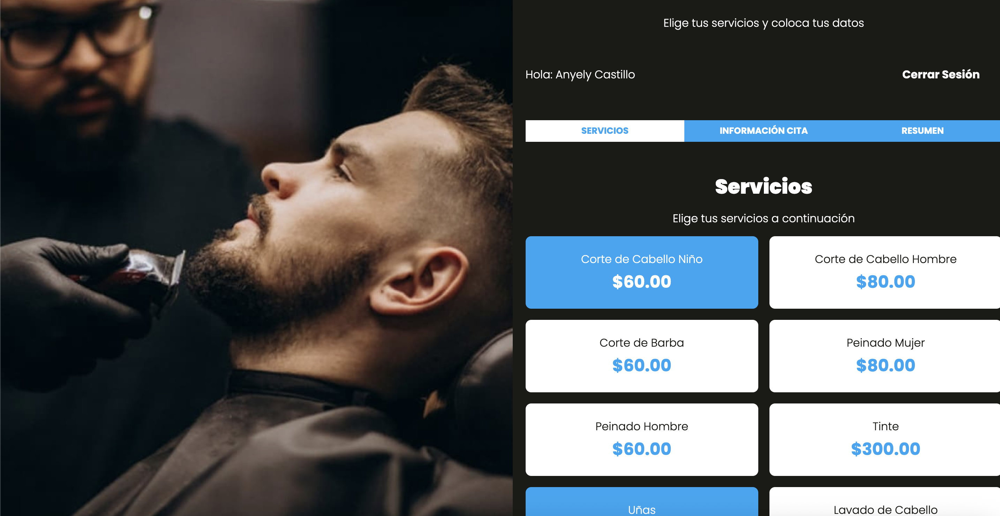

# appsalon-php-practicas

[@dayerlin.es]([https://dayerlin.es](https://anyelycastillo.es/))
[@instagram](https://www.instagram.com/arq.castilloaa/?hl=es)
[@linkedin](https://www.linkedin.com/in/anyely-castillo-duarte)

I have +1 year of experience as a frontend developer, here you will find projects made with different tools and designs for an optimal user interface.

## CV and Certificate

- https://padlet.com/anyelycastillo25/curr-culum-vitae-4s54c26zztjns9vb
- https://padlet.com/anyelycastillo25/t-tulos-acad-micos-certificados-9yfv6hofm7x6bcnt 

### if you like leave me a star

